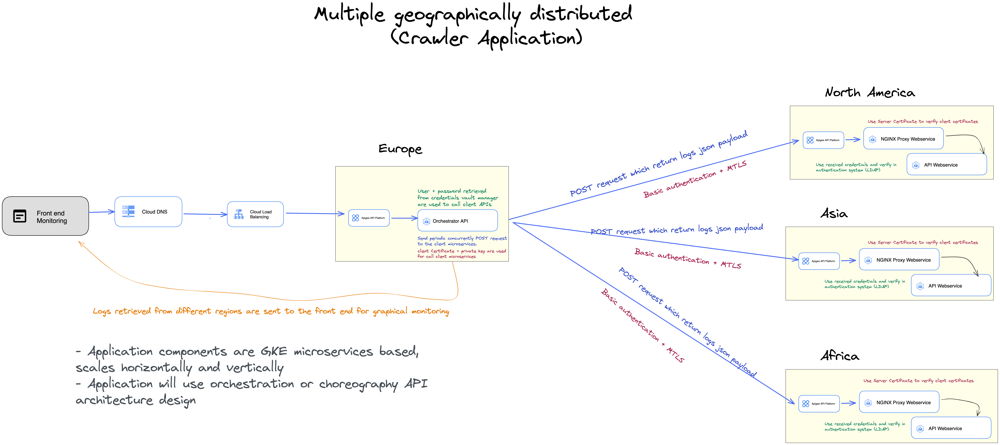

# Web Monitoring (Crawler)

## Overview
This repository implements an online monitoring of web pages according to a parameterized checking period. 
The application parallelize the request to the webpages using concurrently coroutines with semaphore to have better control over their executions. 
This IO-bound application uses mainly built-in python packages, asyncio for concurrent async web request and sched for schedule periodic monitoring.
In addition offer a simple web interface for application monitoring.

## Structure

Here a description of the code content.

- `config: contains the application configuration files`
- `logs: file with the web monitoring information`
- `resources: application resources`
- `src: contains application code`
  - `api: client webservices implementation following MVC architecture`
  - `log_manager: logging configuration files`
  - `utils: utils scripts`
  - `web_monitor: crawler web monitoring script`
  - `api: start up script for the client API webservice `
  - `main_app: start up crawler web monitoring`
  - `server: start up web server for web interface monitoring`


## Installation

After creation of proper virtual environment for python 3.10.4.
Run installation setup script with the following command.

```console
pip install .
```

## How to run the application

The console web monitoring will start up with the below command, set desired value for checking_period_seconds. 
```console
python3 src/main_app.py --checking_period_seconds 1
```
The application will produce the logs on the standard output and write the logging files in the folder ./logs


The web server will start up with the next command, it is possible to set proper port. 

```console
python3 src/server.py --port 5000
```
After the server is running open the browser on the defined port: http://localhost:5000 and click on "Run web crawler" button to see the web logs monitoring.


## Scaling the application (Design topics)

- Assuming we wanted to simultaneously monitor the connectivity (and latencies) from 
multiple geographically distributed locations and collect all the data to a single 
report that always reflects the current status across all locations, describe how 
the design would be different. 

Scaling the application to multiple geographically distributed locations will require API rest architecture solution. 
One centralized API orchestrator will call concurrently to the different API clients (distributed geographically) which will response with the list of collected logs.

- How would you transfer the data ?

The data will be transferred to the central location using API rest payloads which contains the list of log from a specific period.

- What about security concerns ?

The API rest architecture will need to use encryption at transit level (secure connection with basic authentication). 
Additionally, a MTLS authentication to ensures that the API parties have the proper private key.


Here a high level architecture design:



As bonus, it was implemented a client webservices which will be deployed in any client region (In this example, America).
The Europe Orchestrator webservice will call this webservice to collect monitoring logs from America.

For start up the client API web service, run uvicorn on port **8082** with the following script.

```console
python3 src/api.py 
```

Once the Fast API webservice is up, it is possible to call it using the following payload example.

```json
{
    "list_webs":
        [
             ("https://httpbin.org","simple HTTP Request"),
             ("https://example.org","This domain is for use in illustrative examples in documents."),
             ("https://reddit.com","app_html_start"),
             ("https://python.org","Python is a programming language that lets you work quickly")
        ]
}
```
The response payload will be something similar to the below json.

```json
{ 
  "response":[
      {"url":"https://httpbin.org","status":200,"response_time":3.528594970703125e-05,"content_verification":"CORRECT_CONTENT"},
      {"url":"https://example.org","status":200,"response_time":2.8371810913085938e-05,"content_verification":"CORRECT_CONTENT"},
      {"url":"https://reddit.com","status":200,"response_time":2.7555389404296875,"content_verification":"CORRECT_CONTENT"},
      {"url":"https://python.org","status":200,"response_time":0.048532962799072266,"content_verification":"CORRECT_CONTENT"}
    ]
}
```

Try call by yourself to the client webservices using the below command.

```console
python3 test/api/call_api_monitoring.py
```

If you prefer, it is possible to call with a curl command.

```console
curl -X POST http://localhost:8082/api/monitoring/america -H 'Content-Type: application/json' -d @./resources/list_webs.json
```

Secure connection with MTLS and Basic Authentication will be implemented for this client API webservice.

## How to run test cases

If you would like to run some unit tests.

```console
pytest test
```
